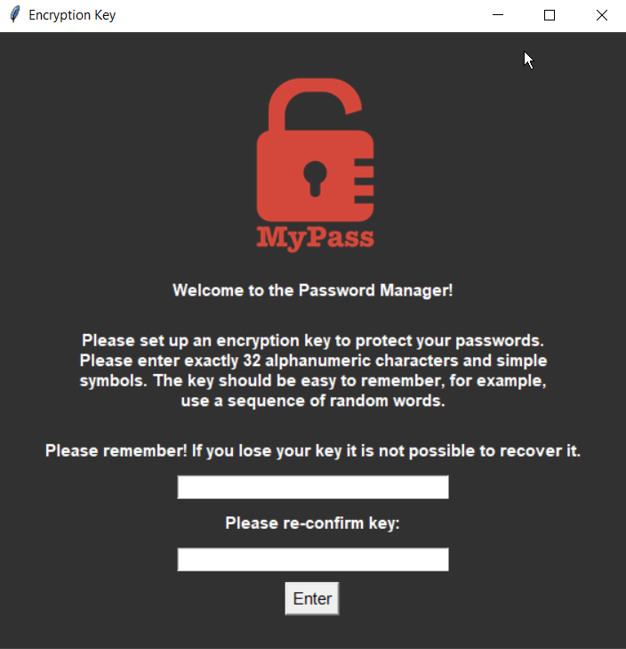
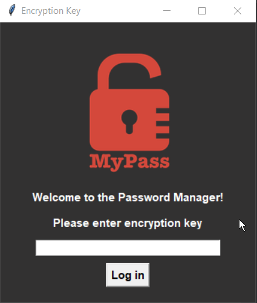
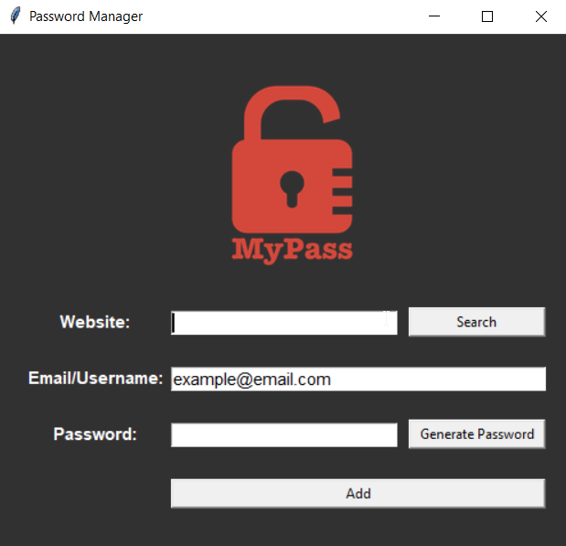
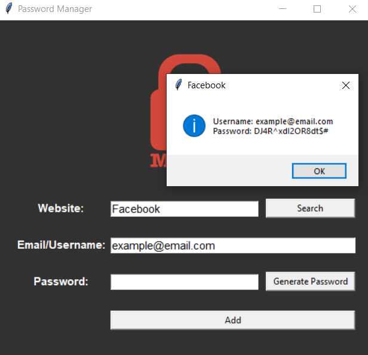

# Password Manager

This program stores your passwords safely on your computer. In current version only one user is allowed per program copy.
In order to run it you will need to install following libraries:

- cryptography: to encrypt your passwords
- bcrypt: to hash your encryption key
- pyperclip: to immediately copy randomly generated passwords

When the program is opened for the first time (or one deletes the file with the encryption key),
the program will ask user to create a new encryption key.  

    

If the key is created successfully it will be hashed and stored in hashed_key.txt file and main UI will show. Every time the user starts the program
it will search for the hashed_key.txt file, and if present it will ask user to enter correct key and compare it with the stored one.

    

When the user logs in successfully the main ui will show up.

    

To store the password put the name of the website for which you are saving the password, the username or email and 
the password. If you want to generate random password, you can click "Generate Password" button. It will automatically copy generated password to the clipboard
so one can immediately use it. After all fields are filled, click "Add" button to store your password. All the information is 
encrypted and stored in data.txt. Once the data is stored, the user can retrieve it by typing the name of website for which the information is stored. If the entry exists, a small window with credentials will show from which one can copy the information.

    

